# TCU NUC build

1. Ubuntu 16.04.7- (desktop image- 64bit version)

2. Power up NUC

    * F2 to visual bio setup  

    * Make  sure default is booting to flash drive  

3. Install Ubuntu

    *  English  

    * Don’t download updates  

    * Install 3rd party software

    * Erase disk and install

    * Use LVM

  * Stay with UEFI

    * LA time zone

    * Username: jhsrobo

    * Pword: JHSRobo

    * Login automatically

4. Wait for install to finnish

5. Remove boot flash drive and boot

6. Wait for software  update popup

  * Click “update” 

  * restart after update

7. search “Ubuntu install of ROS Melodic”

  * First link

  * Follow instructions

    * Install desktop full version

8. Make github folder

   * Enter folder

9. type the command: `git clone releasepage repo`

   * Enter releasepage folder

   * Run tcu_build.sh

10. Idk where his goes, but type:

   * `Cd /etc/udev/rules.d`

   * `Sudo touch joystick.rules`

   * `Sudo nano joystick.rules`

      * Type in opened file: `“KERNAL==“HyACMO” MODE==“06666””`

11. type: `sudo nano /etc/hosts`

   * Insert

      * `192.168.1.100 master`

      * `192.168.1.111 bottomside`

12. type: `cd ~`

   * `sudo nano .bashrc`

      * `Export ROS_MASTER_URI=http://master:11311`

      * `Export ROS_HOSTNAME=master`

      * `Export ROS_IP=192.168.1.100`

   * Type `sudo crontab -e`

      * At the  bottom of the  document, type `@reboot bash /home/jhsrobo/Github/streamer/startup.sh`

## ROV:
### Raspberry Pi 3B+ : Ubuntu MATE 32-bit and ROS Build

This is a brief outline of the 4 steps you will be taking to build a full working ROV image.

   1) Install Ubuntu MATE 32 bit image on flash  (PC)
   2) Complete Ubuntu MATE configuration (Raspberry Pi 3B+/Screen/Keyboard)
   3) Install ROS Kinetic (Raspberry Pi 3B+/Screen/Keyboard)
   4) Verify image on ROV

   1. Download the following image for the core OS build process: Ubuntu Mate 18.04.02 for Raspberry Pi

https://releases.ubuntu-mate.org/archived/bionic/armhf/ubuntu-18.04.2-beta2-desktop-armhf+raspi-ext4.img.xz

|NOTE on 32 bit image|
|-----------------------------------------------------------------------------------------------------------------------------|
|armhf = hardware floating point instructions + 32-bit instruction set. 64-bit ARM supports hardware floating point and NEON |

All archived images can be found at the following location
https://releases.ubuntu-mate.org/archived/bionic/armhf/

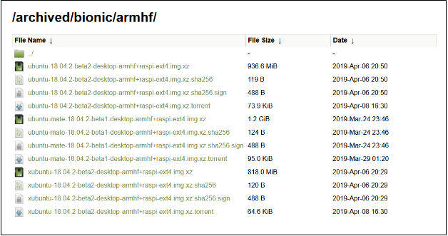

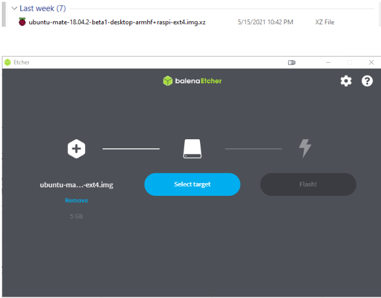

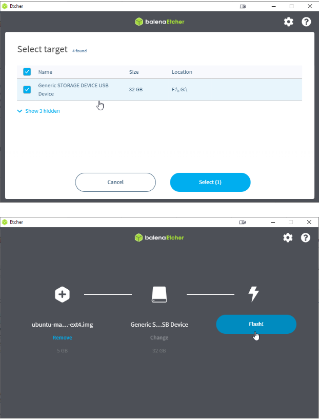

 -Great job, let move on the the next step

   1. Navigate to the “Boot” drive on the SD card. Create a file called ssh (no extension).
     
     a. For example, create ssh.txt – and then remove the .txt extension. The file should be empty.
      
      i. If doing this in Windows, you will have to enable viewing of file extensions.
  
  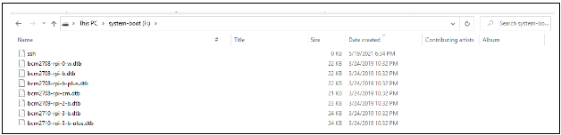
  
  2. Insert SD card into Raspberry Pi 3B+ in order to complete the OS installation process

   3. Go through install procedure
     
     a. LA time zone
    
     b. Username: jhsrobo
     
     c. Password: JHSRobo
     
     d. Login automatically

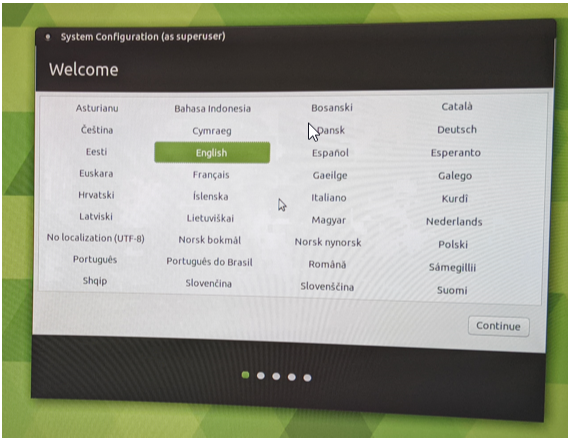

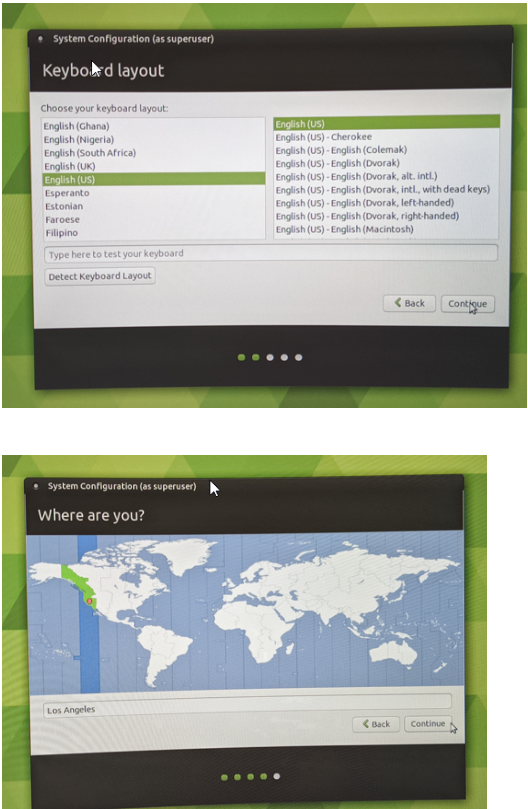

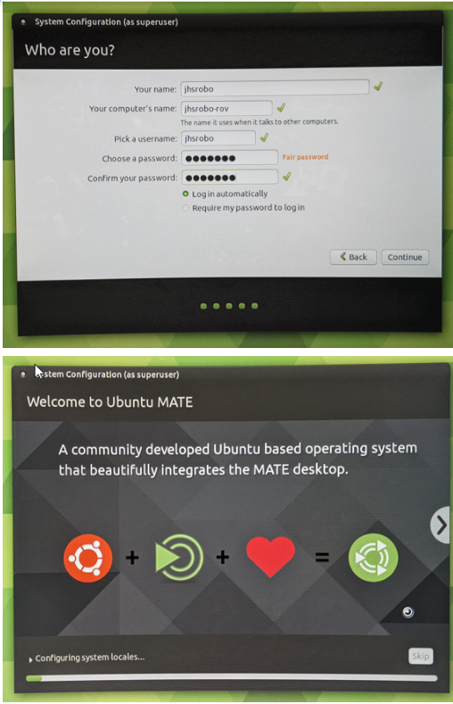

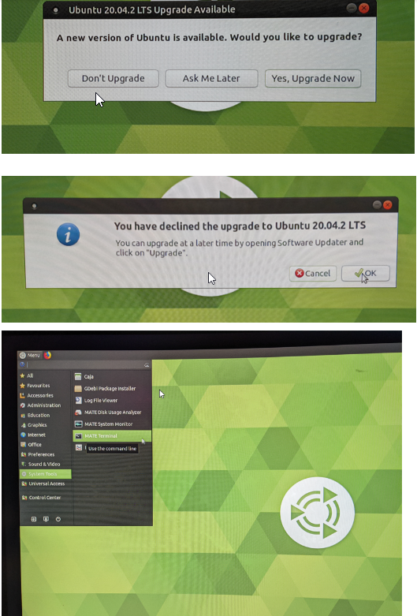

   1. Open the terminal

   2. Enter: `sudo apt update`

   3. Enter: `sudo apt install openssh-server`

   4. Once you are in the terminal type: `sudo raspi-config`

   5. Enter the password (JHSRobo) 

      a. Use arrow keys to select “interfacing options” < Enter >

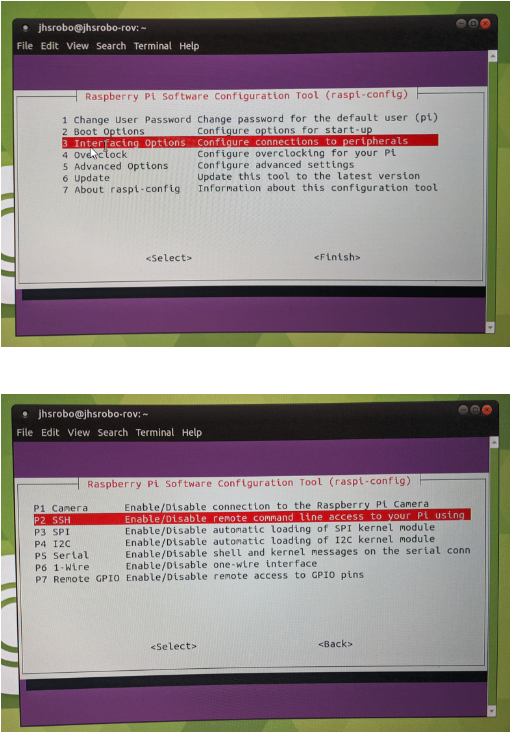

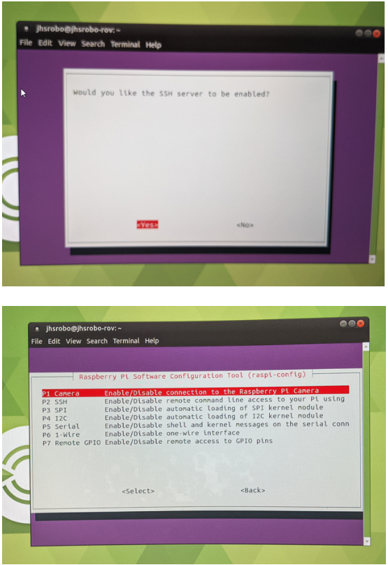

   3. Enter: `sudo ufw allow 22`

   4. Set up the SSH keys for the host

   |jhsrobo@jhsrobo-rov:/etc/ssh$ sudo ssh-keygen -t rsa -b 4096 -f /etc/ssh/ssh_host_rsa_key|
|-|
  | Generating public/private rsa key pair.|
|-|
  | Enter passphrase (empty for no passphrase):|
|-|
   |Enter same passphrase again:|
 |-|  
  | Your identification has been saved in /etc/ssh/ssh_host_rsa_key.|
|-|
  | Your public key has been saved in /etc/ssh/ssh_host_rsa_key.pub.|
|-|
 |  The key fingerprint is:|
|-|
   |SHA256:yvH0dRedRz8/Ec8GyoZFL/fG2rQzIeFOISawDKL47rQ root@jhsrobo-rov|
|-|
  | The key's randomart image is:|
|-|
|+---[RSA 4096]----+|
|-|
|   . . .   .o ...|
|-|
|. . . o o  + o +*|
|-|
|..     o ..o=oo=B|
|-|
| .        o.ooo+*|
|-|
|  .   . S   .+.oB|
|-|
| .   . = . .o..*+|
|-|
|  o   o . .  ..+.|
|-|
| o .            o|
|-|
|  E              |
|-|
|+----[SHA256]-----+|
|-|
|jhsrobo@jhsrobo-rov:/etc/ssh$|
|-|
|jhsrobo@jhsrobo-rov:/etc/ssh$ pwd|
|-|
|/etc/ssh|
|-|
|jhsrobo@jhsrobo-rov:/etc/ssh$ ls -a|
|-|
|.  ..  moduli  ssh_config  sshd_config  ssh_host_rsa_key  ssh_host_rsa_key.pub  ssh_import_id|
|-|
|jhsrobo@jhsrobo-rov:/etc/ssh$ JHSR|

|jhsrobo@jhsrobo-rov:~/Desktop$ ip a|
|-|
|1: lo: <LOOPBACK,UP,LOWER_UP> mtu 65536 qdisc noqueue state UNKNOWN group default qlen 1000|
|-|
|link/loopback 00:00:00:00:00:00 brd 00:00:00:00:00:00|
|-|
|inet 127.0.0.1/8 scope host lo|
|-|
|valid_lft forever preferred_lft forever|
|-|
|inet6 ::1/128 scope host|
|-|
|valid_lft forever preferred_lft forever|
|-|
|2: eth0: <BROADCAST,MULTICAST,UP,LOWER_UP> mtu 1500 qdisc fq_codel state UP group default qlen 1000|
|-|
|link/ether b8:27:eb:0a:39:7d brd ff:ff:ff:ff:ff:ff|
|-|
|inet 192.168.1.140/24 brd 192.168.1.255 scope global dynamic noprefixroute eth0|
|-|
|valid_lft 1995595332sec preferred_lft 1995595332sec|
|-|
|inet6 fe80::361:dce3:5216:8631/64 scope link noprefixroute|
|-|
|valid_lft forever preferred_lft forever|
|-|
|3: wlan0: <NO-CARRIER,BROADCAST,MULTICAST,UP> mtu 1500 qdisc fq_codel state DOWN group default qlen 1000|
|-|
|link/ether b8:27:eb:5f:6c:28 brd ff:ff:ff:ff:ff:ff|

   5. Shutdown, reboot,  and ssh in

   6.You should now be able to SSH to the new device now.  Use the IP address you got from the last step doing the ‘ip a’ command.

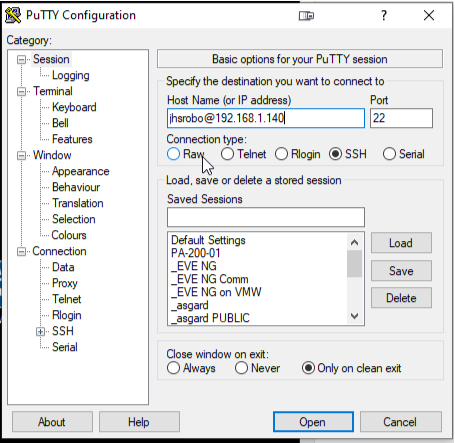

|jhsrobo@jhsrobo-rov:~$ uname -a|
|-|
|Linux jhsrobo-rov 4.15.0-1032-raspi2 #34-Ubuntu SMP PREEMPT Wed Feb 6 11:50:42 UTC 2019 armv7l armv7l          armv7l GNU/Linux|
|-|
|jhsrobo@jhsrobo-rov:~$ cat /etc/lsb-release|
|-|
|DISTRIB_ID=Ubuntu|
|-|
|DISTRIB_RELEASE=18.04|
|-|
|DISTRIB_CODENAME=bionic|
|-|
|DISTRIB_DESCRIPTION="Ubuntu 18.04.2 LTS"|
|-|
|jhsrobo@jhsrobo-rov:~$|

## Time to install ROS Kinetic

   1. We will reference the following document for installation of ROS Kinetic on the ROV Ubuntu MATE OS.
   ROS Kinetic Install Instructions.pdf
      
      a.First link

     b. Follow instructions
     
   c. Install desktop full version

   2. Enter into a terminal: `cd /etc/udev/rules.d`

   3. `sudo touch 60-extra-acl.rules`

   4. `sudo nano 60-extra-acl.rules`

      a. Type: `KERNEL=="ttyUSB[0-9]*", TAG+="udev-acl", TAG+="uaccess"`
   
   5. Leave the window with ctrl+x and enter: `sudo nano /etc/hosts`
   
   6. Insert
      
      a. `192.168.1.100 master`
      
      b. `192.168.1.111 bottomside`
  
  7. `cd`

   8. Enter: `sudo nano .bashrc`

      a. Type: `Export ROS_MASTER_URI=http://master:11311`

      b. Directly under type: `Export ROS_HOSTNAME=bottomside`

      c. Under that type: `Export ROS_IP=192.168.1.111`

   9. Create Swap File

      a. Enter: `sudo swapoff -a`

      b. `sudo dd if=/dev/zero of=/swapfile bs=1M count=8000 status=progress`

      c. `sudo chmod 600 /swapfile`

      d. `sudo mkswap /swapfile`

      e. `sudo swapon /swapfile`

   10. Make new folder named `github`

      a. Enter folder
      
      b. Type: `git clone https://github.com/JHSRobo/releasepage`

      c. Enter releasepage folder
      
      d. Type: `rov_build.sh`

   11. For depth sensor:
      
      a. Type: `sudo apt-get install python-smbus`
      
      b. `sudo raspi-config`

      c. Choose interface-options and enable I2C

